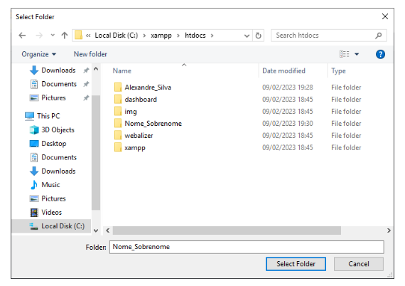
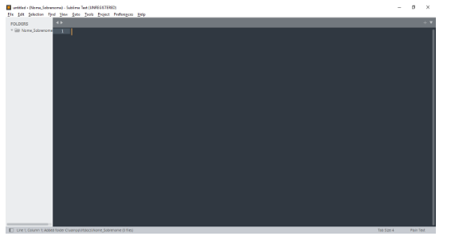
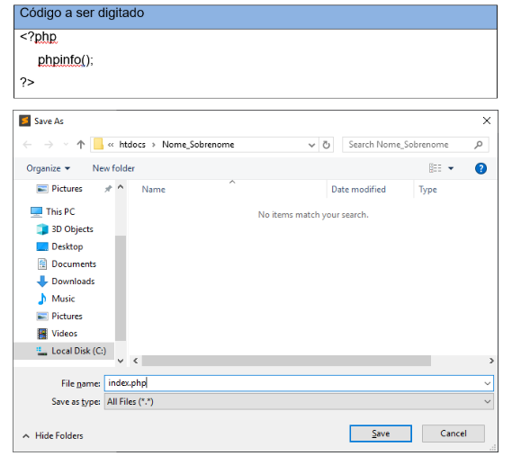
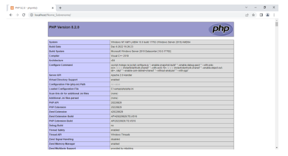
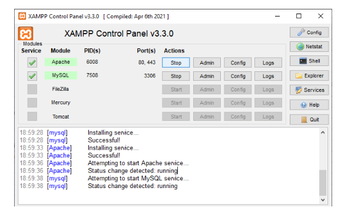
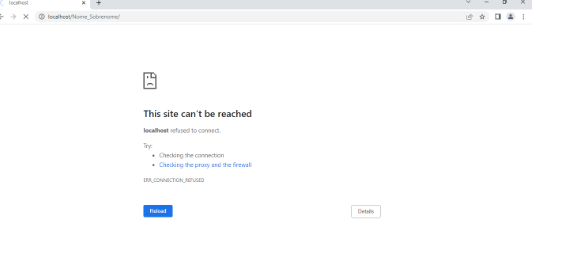
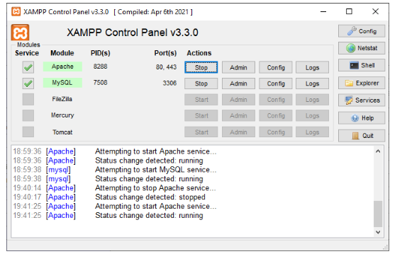
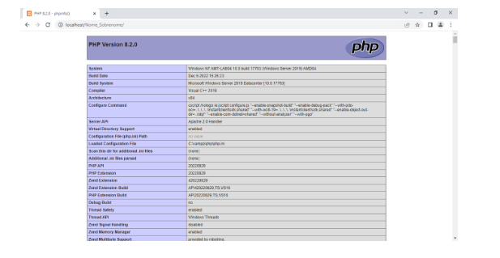

# Conhecer os recursos de desenvolvimento utilizados.

## OBJETIVOS:

Desenvolver um programa em php para verificar se a estrutura está pronta para o desenvolvimento do projeto de Front End

Materiais, Métodos e Ferramentas:

Ambiente XAMPP e Sublime

---

## Atividade Prática - 1

Uma aplicação WEB, necessita de algumas configurações ferramentas necessárias para que ao ser requisitado uma página o sistema deve ter o seu Back end que representa as configurações necessárias para fornecer o acesso e a resposta para a requisição da página.

Para um ambiente esses recursos podem ser o Apache que é um servidor web, ele é instalado em nossos servidores para que as páginas da Internet requisitadas através de um browser (Firefox, Internet Explorer, etc) e o MySQL, que é um sistema gerenciador de banco de dados.

---
## Enunciado:

📘 Utilizando o Sublime Text, desenvolva um projeto com o seu nome underline último nome na pasta C:\xampp\htdocs.
 

📖 Abra o software Sublime Text e clique no menu Project em seguida ADD folder to Project
 

 ---

## Selecione sua pasta e clique em Select Folder

 
---
O resultado deve ser:

---
Digite o código e salve o arquivo como index.php

---

Acesse o Google Chrome e digite o endereço: http://localhost/Nome_Sobrenome/

(Observação: Cuidado com letras maiúsculas e minúsculas o endereço deve ser igual a pasta que você criou).

---
 ## Qual foi o resultado apresentado? 

Abra o Xamp Control panel desative o Apache e execute novamente o endereço http://localhost/Nome_Sobrenome/

--- 

### Qual foi o resultado apresentado? 

Clique em Start para o Apache iniciar verifique se as informações de php são exibidas.

## SOLUÇÃO:

Ao executar a primeira vez o acesso a página as configurações do PHP foram exibidas.

---

Clicando em Stop, o serviço Apache para de rodar

---

E a página não carrega

---

Rodando o Apache novamente o sistema volta a exibir as informações de php.

--
## Pronto!

Observe que o seu projeto deve ser salvo na pasta htdocs e para o sistema funcionar você deve verificar se o serviço Apache e MySQL estão rodando.
