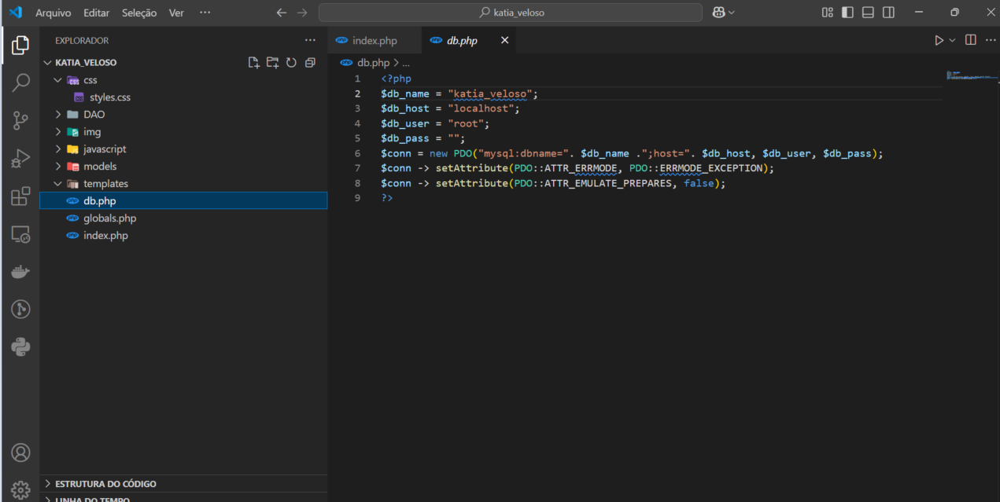

# Criar a conexão com o Banco de Dados

## OBJETIVOS:

Criar arquivo de variáveis globais

Materiais, Métodos e Ferramentas:

Ambiente XAMPP e Sublime

## Atividade Prática - 4

Um sistema necessita utilizar algumas variáveis globais que são variáveis que podem ser utilizadas em qualquer momento que for necessário no sistema.

## Enunciado:


1 - Crie um arquivo chamado globals.php, com a variável dentro da sua pasta com o seu nome e sobrenome.

```
Código que deve ser copiado em globals.php
<?php

 

  session_start();

 

  $BASE_URL = "http://" . $_SERVER["SERVER_NAME"] . dirname($_SERVER["REQUEST_URI"]."?") . "/";

```
2 - Crie um arquivo db.php para realizar a conexão ao banco de dados.

Insira as variáveis:

Código que deve ser copiado em db.php


```
$db_name = “nome_do_seu_banco_de_dados”;

$db_host = “localhost”;

$db_user = “root”;

$db_pass=””; (senha do banco de dados em branco)

$conn = new PDO("mysql:dbname=". $db_name .";host=". $db_host, $db_user, $db_pass);

 

  $conn->setAttribute(PDO::ATTR_ERRMODE, PDO::ERRMODE_EXCEPTION);

  $conn->setAttribute(PDO::ATTR_EMULATE_PREPARES, false);
  
```

3 - No Arquivo index.php insira o código:


Código que deve ser adicionado ao arquivo index.php


```
<?php

          require_once(“db.php”);    

require_once(“globals.php”);

?>

```


4 – Crie a tag <h1>Filmes</h1> em index.php


### Resolução:





---
### Resultado:


